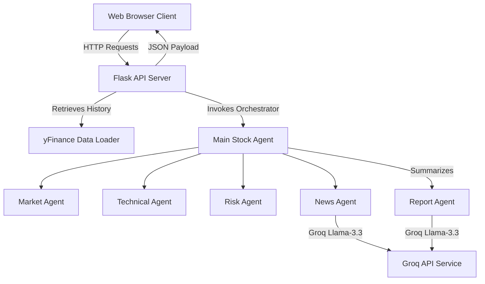

# AI-Powered Financial Risk Analysis Platform

An institutional-grade, multi-agent financial analytics dashboard designed to compute, simulate, and report equity market risks. The platform supports both US and Indian equities with dynamic dashboards, portfolio metrics, risk analysis, and LLM-powered financial advisory reports.

---

## 1. Project Overview
The AI-Powered Financial Risk Analysis Platform is a Python-based web application that leverages a distributed multi-agent intelligence workflow alongside traditional quantitative finance algorithms. The dashboard enables asset managers and retail investors to query specific tickers or portfolios, simulate price actions, analyze technical momentum metrics, project Value at Risk (VaR), and receive compiled institutional-grade investment reports.

---

## 2. Key Features
* **Stock Risk Analysis Dashboard:** Track real-time prices, historical returns, Sharpe ratios, annualized volatility, and moving average crossovers (SMA 50/200).
* **Portfolio Risk Optimizer:** Build custom portfolios and calculate aggregated annualized returns, volatilities, risk profiles, and weight allocations with mock parity rebalancing simulations.
* **Production-Grade Error Boundaries:** Fail-safe mechanisms intercept LLM service (Groq API) outages, rate limits (HTTP 429), or missing keys. Standard warning banners are displayed while core quantitative calculations and charts continue working.
* **AI Service Status Indicators:** Dynamic color-coded status badges on all reports indicating AI Service Online (Green), AI Service Limited (Yellow), or AI Service Unavailable (Red).
* **Multi-Currency Support:** Automatic currency resolution (Rupees `₹` for Indian exchanges `.NS`/`.BO` and Dollars `$` for US exchanges).
* **PDF Exporter:** Download beautifully formatted reports directly to compliance or compliance storage archives.

---

## 3. Architecture Overview



1. **Client Interface:** Communicates with backend endpoints to trigger yFinance fetches and Agent pipeline dispatches.
2. **Quantitative Layer:** The `Market`, `Technical`, and `Risk` agents execute mathematical calculations (such as Sharpe ratios, standard deviations, moving averages) locally on Pandas DataFrames.
3. **Intelligence Layer:** The `News` and `Report` agents feed headlines and metrics into a Groq-powered client using the `llama-3.3-70b-versatile` model.
4. **Resilience Boundary:** If Groq API rate limits are exceeded, localized try/except blocks intercept the exception and feed structured fallback templates back to the client, preventing server crashes.

---

## 4. Folder Structure

```text
financial-risk-platform/
├── agents/                     # Specialized analytical and GenAI agents
│   ├── __init__.py
│   ├── market_agent.py         # Pulls price history & returns
│   ├── technical_agent.py      # Computes moving average trend crossovers
│   ├── risk_agent.py           # Grades volatility and portfolio risk
│   ├── news_agent.py           # Analyzes news sentiment
│   ├── report_agent.py         # Compiles stock research documents
│   ├── portfolio_agent.py      # Computes portfolio statistics
│   └── portfolio_report_agent.py # Compiles portfolio advice
│
├── core/                       # Quantitative calculators and orchestrators
│   ├── __init__.py
│   ├── data_loader.py          # yFinance data loading
│   ├── risk_analysis.py        # Volatility, return, and Sharpe ratios
│   ├── main_agent.py           # Orchestrates single stock agent flows
│   └── portfolio_main_agent.py # Orchestrates portfolio analytics
│
├── docs/                       # Design guides and walkthrough guides
│   ├── DESIGN.md               # Platform architecture specifications
│   └── walkthrough.md          # Implementation review walkthrough
│
├── static/                     # Styling and client-side modules
│   ├── css/                    # Pure styling rules (extracted from HTML)
│   └── js/                     # Event handlers and chart canvas animations
│
├── templates/                  # Script-free Jinja2 HTML structures
│   ├── stock_analysis.html     # Real-time stock dashboard
│   ├── portfolio_analysis.html # Portfolio metrics dashboard
│   ├── risk_dashboard.html    # Detailed volatility risk dashboard
│   ├── reports.html            # AI investment report document viewer
│   └── settings.html           # In-memory preference configurator
│
├── tests/                      # Testing script runners
│   └── (test_market_agent.py, test_main_agent.py, etc.)
│
├── app.py                      # Core entrypoint, API routes, and Flask setup
├── requirements.txt            # Project dependencies list
├── README.md                   # Repository guide
└── .gitignore                  # Git untracked folder list (.env, __pycache__)
```

---

## 5. Installation Instructions

### Prerequisites
* Python 3.10+
* pip (Python package installer)

### Step 1: Clone and Navigate
```bash
git clone https://github.com/your-username/financial-risk-platform.git
cd financial-risk-platform
```

### Step 2: Install Dependencies
```bash
pip install -r requirements.txt
```

### Step 3: Configure Environment
Create a `.env` file at the project root and add your Groq API key:
```env
GROQ_API_KEY=gsk_your_groq_key_here
PORT=5000
```
*(Note: If the key is missing or rate-limited, the application will automatically enter its offline fallback mode without crashing).*

---

## 6. Usage Instructions

### Running the Dashboard
1. Launch the server:
   ```bash
   python app.py
   ```
2. Open your browser and navigate to `http://127.0.0.1:5000`.

### Performing Stock Analysis
* In the **Stock Analysis** page, enter a ticker (e.g. `NVDA` or Indian equities like `RELIANCE.NS`, `TCS.NS`) and click **Run AI Analysis**.
* Toggle to the **AI Analyst Report** tab to view the generated summary or access the **Reports** section from the sidebar drawer to examine detailed audits.

### Portfolio Analysis
* Navigate to **Portfolio Analysis** in the sidebar.
* Input a comma-separated list of tickers (e.g. `AAPL, MSFT, NVDA` or `TCS.NS, TATASTEEL.NS`) to view dynamic weight distributions, aggregate volatility, Sharpe ratios, and asset weights.

---

## 7. Technologies Used

### Frontend
* **Stitch AI** — Dynamic layout prototyping, responsive component structuring, and visual interface styling.
* **Vanilla HTML5 & CSS3** — Fully styled responsive interfaces using curated harmonious dark palettes.
* **TailwindCSS** — Utility configuration classes for streamlined rendering.

### Backend
* **Flask** — Core web application framework and REST API routing.
* **Pandas** — Time-series stock history calculations.
* **NumPy** — Quantitative metrics array computations.
* **yFinance** — Real-time and historical equity data streams.
* **Groq API** — Multi-agent LLM reasoning pipeline (llama-3.3-70b-versatile).
* **Python-Dotenv** — Environment configuration loader.

### Multi-Agent Architecture
* **Market Agent:** Calculates returns, standard deviations, and pricing.
* **Technical Agent:** Maps moving average trends (SMA 50/200).
* **Risk Agent:** Assesses individual volatility levels and grades risk coefficients.
* **News Agent:** Runs market sentiment indexing on yFinance news headline feeds.
* **Report Agent:** Consolidates agent metrics into readable Markdown investment summaries.

---

## 8. Screenshots Section Placeholders
Below are placeholders for the visual screens of the application:

### Stock Analysis Dashboard
*Placeholder: stock_analysis_dashboard.png*

### Portfolio Allocation & Rebalance Parity Map
*Placeholder: portfolio_allocation_chart.png*

### AI Investment Report & Service Badges
*Placeholder: ai_report_status_badges.png*

---

## 9. Future Improvements
1. **Database Persistence:** Integrate Postgres or SQLite to cache stock histories, reducing yFinance socket latency and caching report outputs.
2. **Portfolio Optimization Frontiers:** Replace average allocation weight models with actual Markowitz Efficient Frontier or Risk-Parity optimization algorithms.
3. **Advanced Technical Indicators:** Add RSI, MACD, and Bollinger Bands calculation logic inside `technical_agent.py`.
