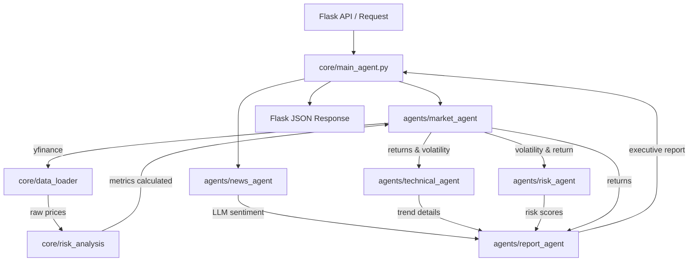

# System Design - Multi-Agent Financial Risk Platform

## Project Overview

### Project Description

AI-Powered Financial Risk Analysis Platform built using Stitch AI for frontend prototyping and Flask for backend services. The platform integrates multiple intelligent agents for market analysis, technical indicators, risk assessment, portfolio intelligence, news analysis, and investment reporting. Supports both US and Indian equities with dynamic dashboards, portfolio analytics, risk monitoring, and AI-driven financial insights.

### Technology Stack

* **Stitch AI** (Frontend Prototyping & UI Generation)
* **Flask** (Backend Framework)
* **Pandas** (Data Processing & Analysis)
* **yFinance** (Market Data Integration)
* **Multi-Agent Architecture** (Market, Technical, Risk, News & Report Agents)
* **Financial Analytics** (Portfolio & Risk Analysis)

---

This document describes the structural design and cooperation patterns of the multi-agent system.

## 1. Core Principles
* **Separation of Concerns**: Core calculation libraries (`core/risk_analysis.py`) are decoupled from AI inference LLM logic.
* **Cooperative Orchestration**: High-level managers (`core/main_agent.py`) pass inputs sequentially to specialized sub-agents.
* **Fail-Safe Defaults**: If external LLM dependencies are down or credentials expire, fallback logic ensures UI dashboards render raw mathematical statistics cleanly.

## 2. Agent Collaboration Architecture

## 3. Agents Details
* **Market Agent (`agents/market_agent.py`)**: Fetches stock histories via yfinance and computes volatility, returns and current pricing, classifying region specifics (INR vs USD).
* **Technical Agent (`agents/technical_agent.py`)**: Identifies moving average cross-overs (SMA 50 vs SMA 200) to gauge bullish/bearish trends.
* **Risk Agent (`agents/risk_agent.py`)**: Applies simple grading heuristics to the returns and volatilities to index stock security score ranges (1-10) and classifications (Low/Medium/High).
* **News Agent (`agents/news_agent.py`)**: Scrapes recent business events and applies Groq LLM reasoning to outline key sentiment patterns.
* **Report Agent (`agents/report_agent.py`)**: Synthesizes the outputs of all agents into a unified, formatted Markdown analyst dispatch.
